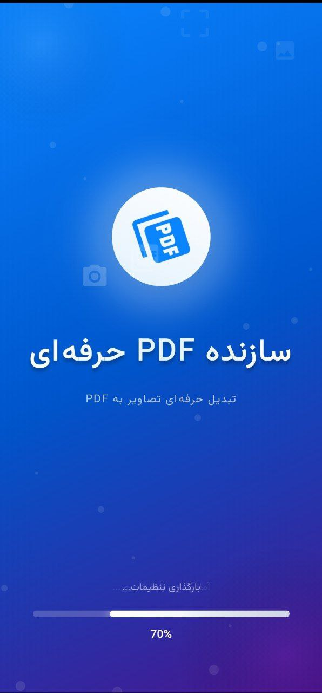
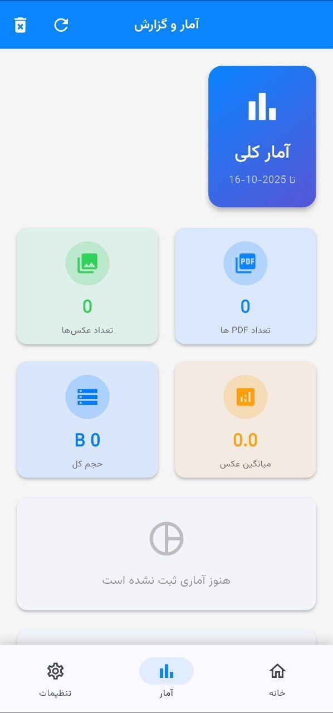
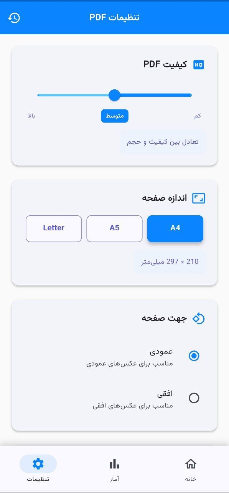

<div align="center">


# 📱 PDF Creator Pro

### *Transform Your Images Into Professional PDFs with Elegance*

<p>
  
  
  
  
</p>

**A beautifully crafted Flutter application that transforms your images into stunning, customizable PDF documents with unmatched ease and elegance.**

<p>
  <a href="#-showcase">Showcase</a> •
  <a href="#-highlights">Highlights</a> •
  <a href="#-features">Features</a> •
  <a href="#-installation">Installation</a> •
  <a href="#-architecture">Architecture</a> •
  <a href="#-contribute">Contribute</a>
</p>

---

</div>

## 📱 Showcase

<div align="center">
  
  
  
  
</div>

<br>

<div align="center">

### 🎨 *Beautiful Design. Powerful Features. Seamless Experience.*

</div>

---

## 🌟 Highlights

<table>
<tr>
<td width="50%">

### 🎯 **Why PDF Creator Pro?**

✨ **Intuitive Interface** - Clean, modern UI that feels natural

🚀 **Lightning Fast** - Convert images to PDF in seconds

🎨 **Fully Customizable** - Control every aspect of your PDFs

📊 **Smart Analytics** - Track your productivity

🌓 **Theme Support** - Beautiful light and dark modes

🌍 **Localized** - Full Persian (Farsi) support with RTL

</td>
<td width="50%">

### 💡 **Perfect For**

📚 Students creating study materials

💼 Professionals organizing documents

📸 Photographers compiling portfolios

📝 Anyone who needs quick PDF conversion

🎯 Users who value quality and customization

✨ People who appreciate beautiful apps

</td>
</tr>
</table>

---

## 🎯 Features

### 📸 **Image Sources** 
<sup>*Pick images your way*</sup>

```
📷 Camera      →  Capture photos instantly
🖼️  Gallery     →  Choose from your collection
📁 Files       →  Import from anywhere
```

### ⚙️ **PDF Customization Engine**
<sup>*Control every detail*</sup>

<table>
<tr>
<td align="center" width="25%">
<br>
<b>Quality Control</b><br>
<sup>Low • Medium • High</sup>
</td>
<td align="center" width="25%">
<br>
<b>Page Size</b><br>
<sup>A4 • A5 • Letter</sup>
</td>
<td align="center" width="25%">
<br>
<b>Orientation</b><br>
<sup>Portrait • Landscape</sup>
</td>
<td align="center" width="25%">
<br>
<b>Page Numbers</b><br>
<sup>Auto-numbering</sup>
</td>
</tr>
</table>

<div align="center">
<sup>✨ Plus custom watermarks for branding</sup>
</div>

### 🖼️ **Advanced Image Management**

| Feature | Description |
|---------|-------------|
| 🔍 **Preview** | Full-screen viewer with pinch-to-zoom |
| 🔀 **Reorder** | Drag & drop to arrange images |
| ℹ️ **Details** | View file name, path, and size |
| 🗑️ **Bulk Delete** | Remove multiple images at once |
| ✂️ **Selection Mode** | Multi-select with ease |

### 📊 **Statistics Dashboard**

Track your productivity with comprehensive analytics:

<div align="center">

| Metric | What You'll See |
|--------|-----------------|
| 📄 **Total PDFs** | Number of PDFs created |
| 🖼️ **Images Processed** | Total images converted |
| 💾 **Storage Used** | Cumulative file size |
| 📈 **Quality Breakdown** | Usage by quality level |
| 📉 **Averages** | Images per PDF • File sizes |

</div>

### ⚡ **Smart Actions**

<table>
<tr>
<td align="center">
<br>
<b>Recent Files</b><br>
<sup>Quick access to your PDFs</sup>
</td>
<td align="center">
<br>
<b>Instant Share</b><br>
<sup>Share with any app</sup>
</td>
<td align="center">
<br>
<b>Open Files</b><br>
<sup>View in PDF reader</sup>
</td>
<td align="center">
<br>
<b>Quick Sheet</b><br>
<sup>Fast action bottom sheet</sup>
</td>
</tr>
</table>

### 🎨 **User Experience**

<div align="center">

```
🌓 Light & Dark Mode    →    Stunning themes for any time
✨ Smooth Animations    →    Fluid, engaging transitions
🚀 Splash Screen        →    Beautiful animated welcome
🌍 Localization        →    Full Persian/Farsi support
📱 Responsive          →    Works on all screen sizes
♿ Accessible          →    Designed for everyone
```

</div>

---

## 🛠️ Tech Stack

<div align="center">

### **Built with Modern Technologies**

</div>

<table>
<tr>
<td align="center" width="33%">

### 🎯 **Core**


</td>
<td align="center" width="33%">

### 🔧 **State**


</td>
<td align="center" width="33%">

### 📦 **Storage**


</td>
</tr>
</table>

### 📚 **Key Dependencies**

<table>
<tr>
<td width="50%">

**PDF & Media**
- `pdf` - PDF generation
- `image_picker` - Camera & Gallery access
- `file_picker` - File system integration
- `path_provider` - Path management

</td>
<td width="50%">

**UI & Utils**
- `google_fonts` - Beautiful typography
- `share_plus` - Cross-platform sharing
- `permission_handler` - Permission management
- `provider` - State management

</td>
</tr>
</table>

---

## 📂 Architecture

<div align="center">

### **Clean Architecture for Scalability**

</div>

```
📦 lib
 ┣ 📂 core
 ┃ ┗ 📂 constants
 ┃   ┣ 📄 colors.dart           # Color palette & themes
 ┃   ┣ 📄 strings.dart          # App-wide strings
 ┃   ┗ 📄 dimensions.dart       # Spacing & sizing
 ┃
 ┣ 📂 providers
 ┃ ┗ 📄 theme_provider.dart     # Theme state management
 ┃
 ┣ 📂 screens
 ┃ ┣ 📄 home_page.dart          # Main dashboard
 ┃ ┣ 📄 settings_page.dart      # App settings
 ┃ ┣ 📄 statistics_page.dart    # Analytics view
 ┃ ┗ 📄 preview_page.dart       # Image preview
 ┃
 ┣ 📂 services
 ┃ ┣ 📄 pdf_service.dart        # PDF generation logic
 ┃ ┣ 📄 statistics_service.dart # Analytics tracking
 ┃ ┗ 📄 storage_service.dart    # Data persistence
 ┃
 ┗ 📄 main.dart                 # App entry point
```

<div align="center">

### 🏗️ **Separation of Concerns**

| Layer | Responsibility |
|-------|----------------|
| 🎨 **Screens** | UI & User Interaction |
| 🔧 **Services** | Business Logic |
| 📦 **Providers** | State Management |
| 🎯 **Core** | Shared Resources |

</div>

---

## 🚀 Installation

<div align="center">

### **Get Started in Minutes**

</div>

### 📋 **Prerequisites**

<table>
<tr>
<td align="center" width="33%">
<br>
<b>Flutter SDK</b><br>
<sup>v3.10.0 or higher</sup>
</td>
<td align="center" width="33%">
<br>
<b>IDE</b><br>
<sup>VS Code or Android Studio</sup>
</td>
<td align="center" width="33%">
<br>
<b>Device</b><br>
<sup>Physical device or emulator</sup>
</td>
</tr>
</table>

### 🔧 **Setup Steps**

<table>
<tr>
<td>

**1️⃣ Clone Repository**
```bash
git clone https://github.com/your-username/pdf_creator.git
```

**2️⃣ Navigate to Directory**
```bash
cd pdf_creator
```

</td>
<td>

**3️⃣ Install Dependencies**
```bash
flutter pub get
```

**4️⃣ Run Application**
```bash
flutter run
```

</td>
</tr>
</table>

<div align="center">

### 🎉 **That's it! You're ready to go!**

</div>

---

## 🤝 Contribute

<div align="center">

### **Join Our Community**

<p>Contributions make the open-source community an amazing place to learn, inspire, and create.</p>
<p><b>Every contribution is valued and appreciated!</b></p>

</div>

### 💡 **How to Contribute**

<table>
<tr>
<td align="center" width="20%">
<br>
<b>1. Fork</b><br>
<sup>Fork the project</sup>
</td>
<td align="center" width="20%">
<br>
<b>2. Branch</b><br>
<sup>Create feature branch</sup>
</td>
<td align="center" width="20%">
<br>
<b>3. Commit</b><br>
<sup>Commit your changes</sup>
</td>
<td align="center" width="20%">
<br>
<b>4. Push</b><br>
<sup>Push to branch</sup>
</td>
<td align="center" width="20%">
<br>
<b>5. PR</b><br>
<sup>Open pull request</sup>
</td>
</tr>
</table>

```bash
# Create your feature branch
git checkout -b feature/AmazingFeature

# Commit your changes
git commit -m 'Add some AmazingFeature'

# Push to the branch
git push origin feature/AmazingFeature

# Open a Pull Request
```

### 🐛 **Found a Bug?**

Open an issue with the `bug` label and provide:
- Clear description
- Steps to reproduce
- Expected vs actual behavior
- Screenshots (if applicable)

### ✨ **Have an Idea?**

Open an issue with the `enhancement` label and share:
- Feature description
- Use cases
- Mockups (if available)

---

## 📜 License

<div align="center">

**MIT License**

This project is licensed under the MIT License - see the [LICENSE](LICENSE) file for details.

<sub>Free to use, modify, and distribute with attribution.</sub>

</div>

---

<div align="center">

### ⭐ **Show Your Support**

<p>If you find this project helpful, please consider giving it a star!</p>
<p>It helps others discover the project and motivates continued development.</p>

<br>

**Made with ❤️ using Flutter**

<br>

[](https://github.com/your-username/pdf_creator)
[](https://twitter.com/your-username)
[](https://linkedin.com/in/your-username)

<br>

<sub>© 2024 PDF Creator Pro. All rights reserved.</sub>

</div>
